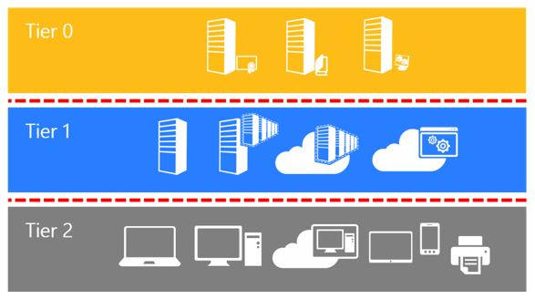
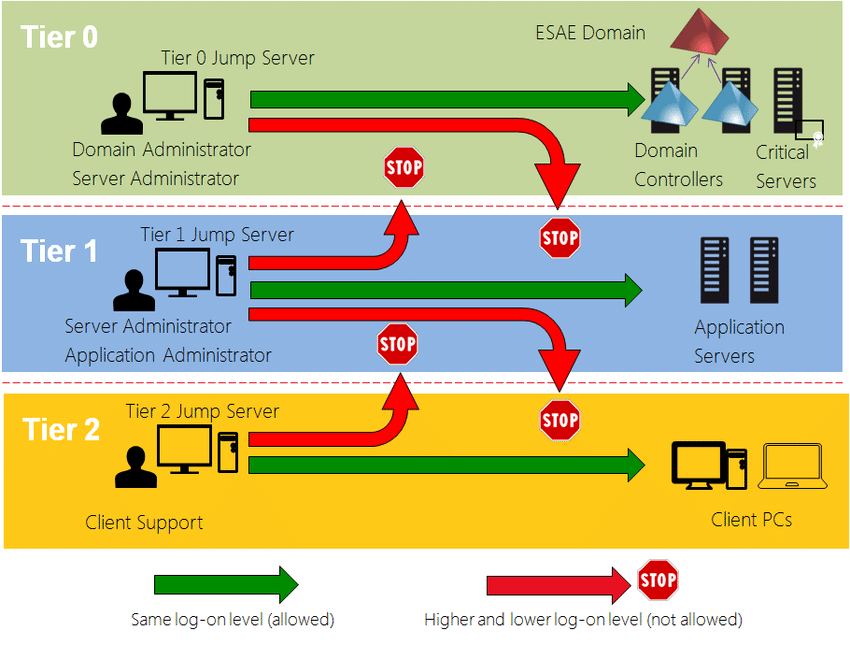
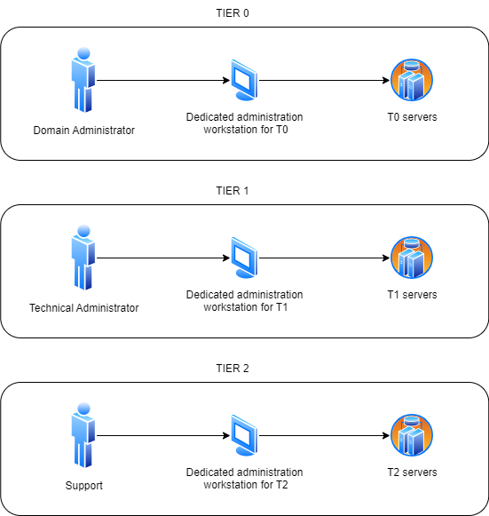
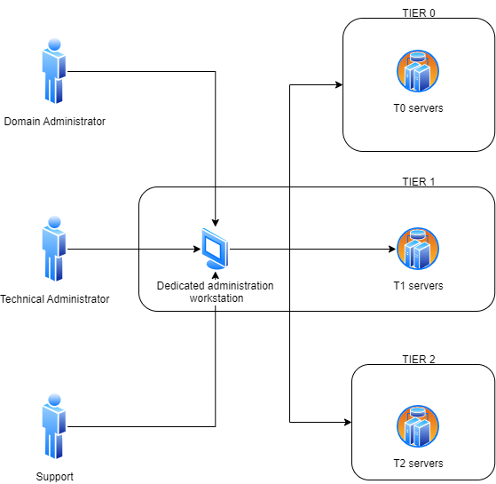
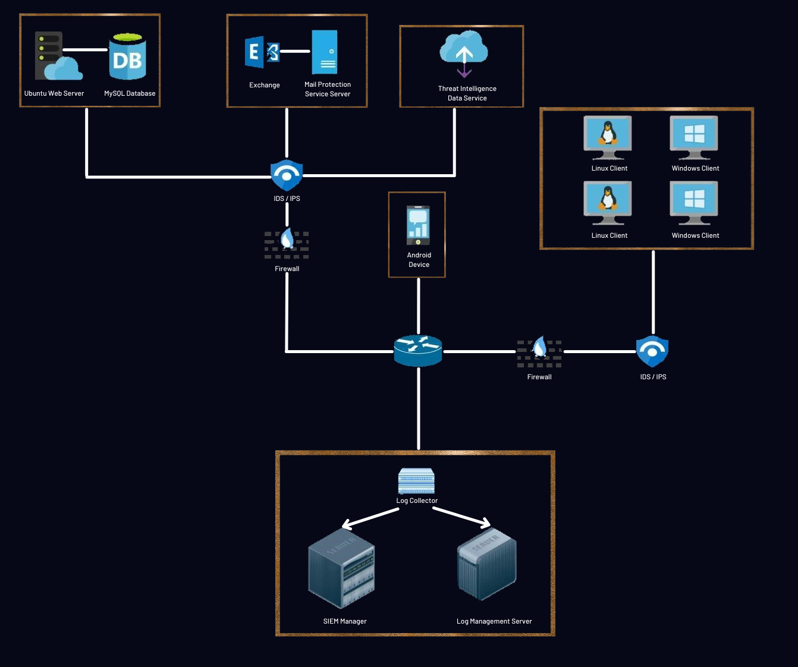
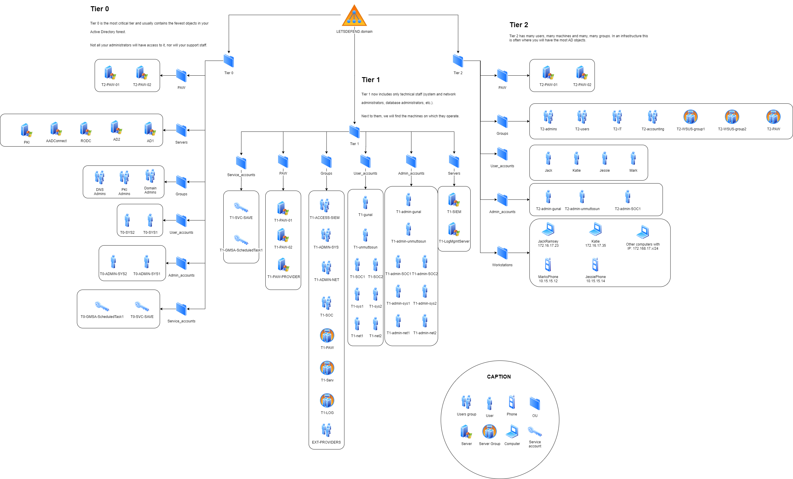

- [WHAT IS THE TIERING ?](#what-is-the-tiering-)
- [ADVANTAGES / DISADVANTAGES](#advantages--disadvantages)
  - [ADVANTAGES](#advantages)
  - [DISADVANTAGES](#disadvantages)
- [PRESENTATION DES TROIS TIERS](#presentation-des-trois-tiers)
  - [TIER 0](#tier-0)
  - [TIER 1](#tier-1)
  - [TIER 2](#tier-2)
- [ADMINISTRATION](#administration)
  - [PRIVILEGES ACCESS WORKSTATIONS FOR ADMINISTRATION](#privileges-access-workstations-for-administration)
    - [SOLUTION 1 : ONE PAW PER TIER](#solution-1--one-paw-per-tier)
    - [SOLUTION 2 : A SINGLE PAW](#solution-2--a-single-paw)
- [EXERCICE PRATIQUE : LETSDEFEND](#exercice-pratique--letsdefend)
- [DOCUMENTATIONS](#documentations)

# WHAT IS THE TIERING ?
The three-tier architecture of an Active Directory is an infrastructure architecture that separates the different parts of a network into three distinct layers. This architecture has been recommended by Microsoft for many years for Active Directory-based infrastructure and is widely used in companies of all sizes.

There is no specific reference that requires the implementation of this architecture, but it is often considered a solid network design practice and recommended for most businesses.

The advantage of three-tier architecture is that it is deployable on all the infrastructure you will encounter.

It is a proven model that has evolved to incorporate the Cloud, but it remains a foundation to be set up in your infrastructure.

# ADVANTAGES / DISADVANTAGES
## ADVANTAGES
* Security: The three-tier architecture separates different parts of a network into distinct layers, which can help protect sensitive data from unauthorized access.
* Scalability: This architecture is designed to be scalable, meaning it can be extended or modified to meet changing business needs.
* Ease of maintenance: By separating different parts of the network into distinct layers, it is easier to locate and troubleshoot any issues that may arise.
* Flexibility: The three-tier architecture allows different parts of the network to be modified or upgraded independently of each other.
## DISADVANTAGES
* Cost: This architecture can be costly to implement and maintain, particularly if it involves purchasing additional licenses or hardware.
* Complexity: This architecture can be complex to set up and manage, especially for administrators who are not familiar with how it works.
* Resource consumption: The three-tier architecture can be resource-intensive (e.g. in terms of processing power, disk space, etc.), which can increase operating costs.
* Difficulty adapting: It can be difficult to adapt this architecture to specific needs or changes in the business environment.

# PRESENTATION DES TROIS TIERS
## TIER 0
The tier 0 contains everything that manages the access control and identity of your company.

We will therefore find: 
* Domain Controller
* Server for Azure ADConnect
* Internals PKI
* Administrators account with domain management powers
* etc.

## TIER 1
The tier 1 contains all your internals servers and applications. 

We will therefore find:  
* WSUS 
* Web server
* Files server
* Spooler 
* Technical administrator account 
* Functional application administrator accounts
* Backup server (can be put in the T0 to increase security depending on the accesses needed). 
* Etc. 

## TIER 2
The tier 2 includes all workstations, mobile devices and generally everything that your users physically have in their hands. 

We will therefore find: 
* Workstations 
* Tablet 
* Phones
* Printers 
* user account (User account used every day)
* Etc. 

# ADMINISTRATION
Although the theoretical schema is easy to understand, it can result in an administration complexity compared to the habits taken by many administrators who connect directly to servers from their workstations.

The different layers and their accounts are isolated from each other, which means that the same staff may have up to three administration accounts depending on the perimeter they need to intervene in and three standard accounts for taking control (see next chapter).

Fortunately, only technically competent staff who are capable of understanding the benefit of this measure and using tools such as password managers or a remote desktop manager are expected to intervene on the three layers.

## PRIVILEGES ACCESS WORKSTATIONS FOR ADMINISTRATION
Regardless of the technologies behind your bounce servers (Wallix, Guacamole, Windows, etc.), the placement of your bounces will remain the same.

### SOLUTION 1 : ONE PAW PER TIER
This is the most secure solution, but also the most expensive in terms of licenses or maintenance.

In this solution, we deploy a bounce server per layer. We also add a dedicated bounce for potential external interveners.

Each user connects to a bounce dedicated to the layer, with their user account for that layer.
They then use the administration account as needed on the necessary infrastructure.

### SOLUTION 2 : A SINGLE PAW
This solution is not recommended because it goes against the principle of three-tier architecture.

Unfortunately, the first solution may encounter financial (costs of multiple bounces) and technical (resource consumption) reality.

However, it does allow for securing the infrastructure at a lower cost by deploying a single bounce server for your administrators to manage the three layers. Ideally, make a second bounce for your contractors.

In this case, the bounce server will be positioned in tier 1 because it meets a functional need for administration. Placing this bounce in tier 0 would go against the principle of minimal privileges.

# EXERCICE PRATIQUE : LETSDEFEND
For this case study, we will use the topology provided by [LetsDefend](https://app.letsdefend.io/tutorial/topology) as well as the information from the training lab.

The goal is not to be exhaustive, but to show you that it is easy to set up, at least on paper.

# DOCUMENTATIONS
* [Isolation du T0 via GPO](https://techcommunity.microsoft.com/t5/core-infrastructure-and-security/initially-isolate-tier-0-assets-with-group-policy-to-start/ba-p/1184934)
* [Tiering par Microsoft](https://learn.microsoft.com/fr-fr/security/compass/privileged-access-access-model)
* [Mise en place de Bastion](https://learn.microsoft.com/fr-fr/microsoft-identity-manager/pam/planning-bastion-environment)