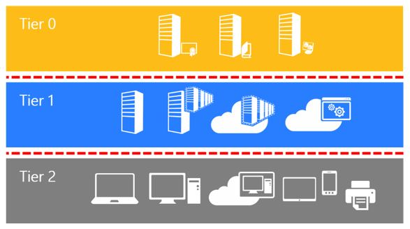

- [PRÉSENTATION DU TIERING](#présentation-du-tiering)
- [AVANTAGES / INCONVENIENTS](#avantages--inconvenients)
  - [AVANTAGES](#avantages)
  - [INCONVENIENTS](#inconvenients)
- [PRESENTATION DES TROIS TIERS](#presentation-des-trois-tiers)
  - [TIER 0](#tier-0)
  - [TIER 1](#tier-1)
  - [TIER 2](#tier-2)
- [ADMINISTRATION](#administration)
  - [GESTION DES REBONDS](#gestion-des-rebonds)
    - [SOLUTION 1 : UN REBOND PAR TIER](#solution-1--un-rebond-par-tier)
    - [SOLUTION 2 : UN REBOND UNIQUE](#solution-2--un-rebond-unique)
- [EXERCICE PRATIQUE : LETSDEFEND](#exercice-pratique--letsdefend)
- [DOCUMENTATIONS](#documentations)

# PRÉSENTATION DU TIERING 
La structure en tiers (ou "three-tier architecture") d'un Active Directory est une architecture d’infrastructure qui sépare les différentes parties d'un réseau en trois couches distinctes. Cette architecture est recommandée par Microsoft depuis de nombreuses années pour les infrastructures basées sur Active Directory et est largement utilisée dans les entreprises de toutes tailles.

Il n'y a pas de référentiel spécifique qui impose la mise en place de cette architecture, mais elle est souvent considérée comme une pratique de conception de réseau solide et recommandée pour la plupart des entreprises.

L'avantage de l'architecture en tiers est qu'elle est déployable sur l'ensemble des infrastructures que vous rencontrerez.

C'est un modèle éprouvé qui a su évoluer pour intégrer le Cloud, mais qui reste une base à mettre en place dans votre infrastructure.

# AVANTAGES / INCONVENIENTS
## AVANTAGES
* Sécurité : l'architecture en trois couches permet de séparer les différentes parties d'un réseau en couches distinctes, ce qui peut aider à protéger les données sensibles contre les accès non autorisés.
* Évolutivité : cette architecture est conçue de manière à être évolutive, ce qui signifie qu'elle peut être étendue ou modifiée pour répondre aux besoins changeants de l'entreprise.
* Facilité de maintenance : en séparant les différentes parties du réseau en couches distinctes, il est plus facile de localiser et de résoudre les problèmes qui peuvent survenir.
* Flexibilité : l'architecture en trois couches permet de séparer les différentes parties du réseau de manière à ce qu'elles puissent être modifiées ou mises à niveau indépendamment les unes des autres.

## INCONVENIENTS
* Coût : cette architecture peut être coûteuse à mettre en place et à maintenir, en particulier si elle implique l'achat de licences ou de matériel supplémentaire.
* Complexité : cette architecture peut être complexe à mettre en place et à gérer, en particulier pour les administrateurs qui ne sont pas familiarisés avec son fonctionnement.
* Consommation de ressources : l'architecture en trois couches peut être gourmande en termes de ressources (par exemple, puissance de calcul, espace disque, etc.), ce qui peut entraîner une augmentation des coûts de fonctionnement.
* Difficulté à adapter : il peut être difficile d'adapter cette architecture à des besoins spécifiques ou à des changements de l'environnement de l'entreprise.

# PRESENTATION DES TROIS TIERS
## TIER 0
Le tier 0 contient tout ce qui gère le contrôle d'accès et identité de votre entreprise.

On y retrouvera donc : 
* Contrôleur de domaine
* Serveur Azure ADConnect
* PKI internes
* Comptes administrateurs avec des pouvoir sur la gestion du domaine
* etc.

## TIER 1
Le tier 1 regroupe les serveurs et applications interne de l’Entreprise. 

On y retrouvera donc :  
* Serveur WSUS 
* Serveurs web 
* Serveurs de fichiers 
* Serveurs d’impression 
* Comptes administrateurs techniques des serveurs 
* Comptes administrateurs fonctionnelles des applications 
* Serveur de sauvegardes (peut-être mis dans le T0 pour augmenter la sécurité en fonction des accès nécessaires). 
* Etc. 

## TIER 2
Le tier 2 regroupe l’ensemble des stations de travails, terminaux mobiles et d’une manière générale tout ce que vos utilisateurs ont physiquement entre leurs mains. 

On y retrouvera donc :
* Postes de travail 
* Tablettes professionnelles 
* Téléphones professionnels 
* Imprimantes 
* Comptes utilisateurs bureautique 
* Etc. 

# ADMINISTRATION
Bien que le schéma théorique soit simple à comprendre, il peut en résulter une complexification de l'administration par rapport aux habitudes prises par de nombreux administrateurs qui se connectent aux serveurs directement depuis leurs postes.

Les différentes couches et leurs comptes sont isolés les uns des autres, ce qui implique qu'un même personnel peut avoir jusqu'à trois comptes d'administration en fonction du périmètre sur lequel il doit intervenir et trois comptes standard pour les prises en main (voir chapitre suivant).

Heureusement, seuls les personnels techniquement compétents et capables de comprendre l'intérêt de cette mesure et d'utiliser des outils tels que des gestionnaires de mots de passe ou un gestionnaire de bureau à distance sont censés intervenir sur les trois couches.

## GESTION DES REBONDS
Quel que soient les technologies derrière vos rebonds (Wallix, Guacamole, Windows, etc.), le placement de vos rebonds restera le même.

### SOLUTION 1 : UN REBOND PAR TIER
Il s'agit de la solution la plus sécurisée, mais aussi la plus coûteuse en termes de licences ou de maintenance.

Dans cette solution, nous déployons un serveur de rebond par couche. Nous ajoutons également un rebond dédié pour les intervenants extérieurs potentiels.

Chaque utilisateur se connecte sur un rebond dédié à la couche, avec son compte utilisateur de cette couche.
Il utilise ensuite le compte d'administration en fonction des besoins sur les infrastructures nécessaires.

### SOLUTION 2 : UN REBOND UNIQUE
Cette solution n'est pas recommandée, car elle va à l'encontre du principe de l'architecture en tiers.

Malheureusement, la première solution peut se heurter à la réalité financière (coûts de multiples rebonds) et technique (consommation de ressources).

Elle permet cependant de sécuriser l'infrastructure à moindre coût en déployant un seul serveur de rebond pour vos administrateurs afin de gérer les trois couches.
Idéalement, faite un second rebond pour vos prestataires.

Dans ce cas de figure, le serveur de rebond sera positionné dans le tier 1 car il répond à une nécessité fonctionnelle d'administration. La mise en place de ce rebond dans le tier 0 irait à l'encontre du principe de privilèges minimaux.

# EXERCICE PRATIQUE : LETSDEFEND
Pour ce cas pratique on va utiliser la topologie fournis par [LetsDefend](https://app.letsdefend.io/tutorial/topology) ainsi que les informations du lab d'entrainement.

Le but n'est pas d'être exhaustif mais de vous montrer que c'est facile à mettre en place, au moins sur le papier.

# DOCUMENTATIONS
* [Isolation du T0 via GPO](https://techcommunity.microsoft.com/t5/core-infrastructure-and-security/initially-isolate-tier-0-assets-with-group-policy-to-start/ba-p/1184934)
* [Tiering par Microsoft](https://learn.microsoft.com/fr-fr/security/compass/privileged-access-access-model)
* [Mise en place de Bastion](https://learn.microsoft.com/fr-fr/microsoft-identity-manager/pam/planning-bastion-environment)
* [Création d'un rebond à bas coût](https://blog.mssec.fr/realiser-un-bastion-de-tier-0-abordable-1-5/)
